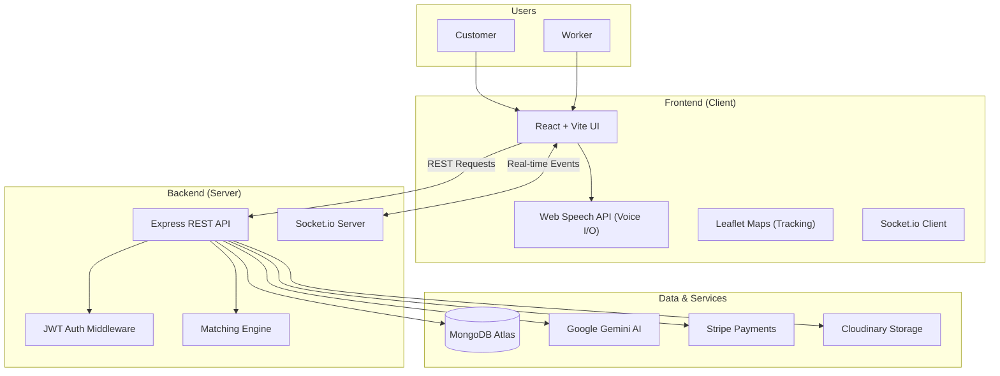

# WorkLink - Smart AI-Powered Service Marketplace 🚀


> **Submission for Problem Statement 7: Full Stack (Frontend + Backend) – End-to-End Web Application**  
> _Theme: Bridging the digital divide for blue-collar workers through a secure, structured, and AI-enabled on-demand marketplace._

---

## 📖 Table of Contents

- [Project Overview](#-project-overview)
- [System Architecture](#-system-architecture)
- [Key Features](#-key-features)
- [Tech Stack](#-tech-stack)
- [API Documentation](#-api-documentation)
- [Database Schema](#-database-schema)
- [Installation & Setup](#-installation--setup)
- [Troubleshooting](#-troubleshooting)

---

## 📖 Project Overview

**WorkLink** is a next-generation platform designed to organize the unorganized service sector. It connects customers with skilled local workers (plumbers, electricians, cleaners) through a seamless, real-time interface.

What makes WorkLink unique is its **AI-First approach**:

1.  **For Workers:** An AI companion that speaks their language (literally - via Voice & Translation), helping them manage jobs and communicate professionally.
2.  **For Customers:** An intelligent concierge that converts vague voice commands (e.g., "I need someone to fix my tap urgently") into structured job posts with categorized skills and budget estimates.

This project demonstrates a complete **System Thinking** approach, handling everything from the initial intent to the final secure payment.

---

## 🏗️ System Architecture

The application uses a reliable Monorepo structure (Client + Server).



---

## 🌟 Key Features

### 🧠 1. Voice-Enabled AI Assistant (Gemini 2.0)

- **Role-Aware Context:** The AI behaves differently based on who is logged in.
  - _Worker Mode:_ Acts as a supervisor/coach. Mentors them on how to reply to customers.
  - _Customer Mode:_ Acts as a service concierge. Helps draft job descriptions.
- **Voice-to-Voice:** Users can tap the microphone to speak, and the assistant replies with synthesized speech.
- **Auto-Healing:** Backend automatically switches between `gemini-2.0-flash`, `gemini-1.5-flash`, and other models if one fails or is rate-limited.

### 📍 2. Geospatial Matching & Live Tracking

- **Smart Matching:** Workers are filtered by **Skill Match** AND **Wait-time** AND **Distance** (using MongoDB `$near` queries).
- **Real-Time Map:** Customers can see the worker's live location approaching their house on a map (Leaflet.js) once a job is started.

### 🛡️ 3. Security & Trust Flow

- **OTP Verification:** A "Digital Handshake". The job timer _cannot_ start until the worker enters the 4-digit OTP provided by the customer at the location.
- **Escrow Payments:** Funds are reserved via Stripe when a job is accepted but only released when the OTP verifies completion.
- **Encrypted Data:** Passwords hashed with Bcrypt, API communication secured with JWT.

### 💬 4. Multi-Language Communication

- **Translation Layer:** UI supports English, Hindi (हिन्दी), and Telugu (తెలుగు).
- **Chat System:** Integrated text and image chat that allows structured negotiation without leaving the app.

---

## 💻 Tech Stack

### **Frontend (Client)**

| Technology           | Purpose                                |
| :------------------- | :------------------------------------- |
| **React 18**         | Component-based UI Architecture        |
| **Vite**             | Lightning-fast build tool              |
| **Tailwind CSS**     | Responsive styling system              |
| **Framer Motion**    | Smooth UI transitions & animations     |
| **React Leaflet**    | Interactive maps for location tracking |
| **Socket.io Client** | Real-time bi-directional communication |
| **Lucide React**     | Modern, clean icon set                 |

### **Backend (Server)**

| Technology              | Purpose                                   |
| :---------------------- | :---------------------------------------- |
| **Node.js**             | JavaScript Runtime                        |
| **Express.js**          | REST API Framework                        |
| **MongoDB (Mongoose)**  | NoSQL Database for scalable data models   |
| **Google GenAI SDK**    | Integration with Gemini Models            |
| **Socket.io**           | WebSocket server for chat & notifications |
| **Stripe**              | Payment processing gateway                |
| **Multer / Cloudinary** | File upload and cloud storage             |

---

## 🔌 API Documentation

### **Authentication**

- `POST /api/auth/register` - Register a new User (Customer/Worker)
- `POST /api/auth/login` - Login and receive `token`
- `GET /api/auth/me` - Get current user profile (Protected)

### **AI Services**

- `POST /api/ai/chat` - Send a message to the AI Assistant.
  - _Body:_ `{ "message": "Help me find a plumber", "context": "..." }`
- `POST /api/ai/job-assistant` - Parse natural language into structured Job JSON.

### **Jobs Module**

- `POST /api/jobs` - Create a new Service Request.
- `GET /api/jobs/nearby` - Find jobs within X kilometers (Worker only).
- `GET /api/jobs/:id` - Get full details of a specific job.
- `PATCH /api/jobs/:id/bid` - Worker places a bid.
- `PATCH /api/jobs/:id/assign` - Customer accepts a worker.
- `PATCH /api/jobs/:id/verify-start` - Worker inputs OTP to start job.
- `PATCH /api/jobs/:id/complete` - Mark job as done (trigger payment).

### **Real-Time & Chat**

- `GET /api/notifications` - Get list of alerts.
- `POST /api/chat/rooms` - Create/Get chat room for a Job.
- `POST /api/chat/messages` - Send a text/image message.

---

## 📂 Database Schema

Our database is normalized for flexibility and scale.

1.  **User**: Authenticaton details, roles (`customer`, `worker`), language preference.
2.  **WorkerProfile**: Extends User. Stores `skills` (array), `hourlyRate`, `location` (GeoJSON), `metrics` (rating, jobs completed).
3.  **Job**: The core entity. Links `customer` and `worker`.
    - `status`: `OPEN`, `ASSIGNED`, `IN_PROGRESS`, `COMPLETED`, `PAID`.
    - `location`: GeoJSON point.
    - `verification`: Stores the generated OTP.
4.  **ChatRoom**: Connects two users with a `jobId`.
5.  **Notification**: Event-driven alerts (Job Accepted, Payment Received).

---

## 🚀 Installation & Setup

Follow these steps to run the full stack locally.

### 1. Prerequisites

- Node.js (v16 or higher)
- MongoDB (Local or Atlas URL)
- Google Gemini API Key
- Cloudinary Credentials (for image uploads)

### 2. Clone the Repo

```bash
git clone https://github.com/KhadirShaikL21/worklink-smart-marketplace.git
cd worklink-smart-marketplace
```

### 3. Backend Setup

```bash
cd server
npm install

# Create a .env file with the following:
# PORT=5000
# MONGODB_URI=your_mongo_url
# JWT_SECRET=your_jwt_secret
# GEMINI_API_KEY=your_google_ai_key
# CLOUDINARY_CLOUD_NAME=...
# CLOUDINARY_API_KEY=...
# CLOUDINARY_API_SECRET=...

npm run dev
```

_Server will run on http://localhost:5000_

### 4. Frontend Setup

```bash
cd ../client
npm install
npm run dev
```

_Client will run on http://localhost:5173_

---

## 🔮 Future Roadmap

- [ ] Integration with WhatsApp Business API for notifications.
- [ ] AR (Augmented Reality) measurement tool for workers.
- [ ] Blockchain-based reputation system for verified reviews.

---

_Winner Application - Problem Statement 7 - Full Stack Development_
