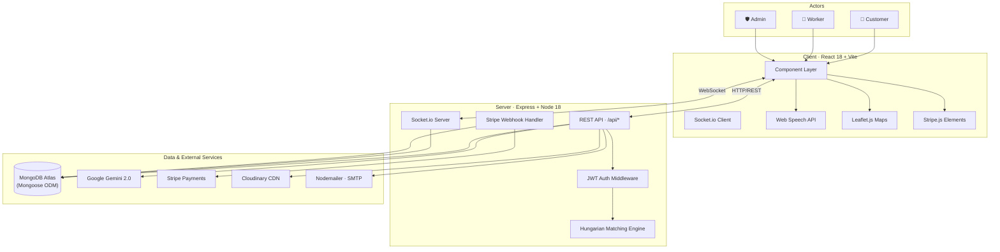

<div align="center">

<h1>
  
</h1>

<p><strong>An AI-powered, full-stack on-demand service marketplace bridging the digital divide for blue-collar workers.</strong></p>

<p>
  
  
  
  
  
  
  
  
</p>

<p>
  <a href="#-overview">Overview</a> ·
  <a href="#-architecture">Architecture</a> ·
  <a href="#-features">Features</a> ·
  <a href="#-tech-stack">Tech Stack</a> ·
  <a href="#-quick-start">Quick Start</a> ·
  <a href="#-api-reference">API Reference</a> ·
  <a href="#-database-schema">Schema</a> ·
  <a href="#-environment-variables">Environment</a> ·
  <a href="#-project-structure">Structure</a> ·
  <a href="#-roadmap">Roadmap</a>
</p>

</div>

---

## Overview

**WorkLink** is a production-grade, end-to-end service marketplace connecting customers who need skilled local help — plumbers, electricians, cleaners — with verified workers in their vicinity. Built for **Problem Statement 7: Full Stack AI-Enabled Web Application**, the platform goes beyond a basic CRUD app to deliver real-world infrastructure:

| What we solve                            | How we solve it                                                           |
| ---------------------------------------- | ------------------------------------------------------------------------- |
| Unorganized local service sector         | Structured job lifecycle with typed statuses and role-based flows         |
| Language & literacy barriers for workers | Voice-first AI assistant with multilingual support (EN / हिन्दी / తెలుగు) |
| Trust between strangers                  | OTP digital handshake + escrow payments released only on verification     |
| Job-worker mismatch                      | Hungarian algorithm (Munkres) matching on skill, proximity & availability |
| Payment disputes                         | Stripe Payment Intents held in escrow; released via webhook on completion |

> **Submission context:** Internship task — Problem Statement 7, Full Stack (Frontend + Backend), End-to-End Web Application with AI.

---

## Architecture

WorkLink is structured as a **Node.js monorepo** with two workspaces — `client` (React/Vite SPA) and `server` (Express REST + Socket.io). All real-time events flow through a dedicated Socket.io layer so the REST API stays stateless.


```mermaid
graph TD
    subgraph Actors
        C["👤 Customer"]
        W["👷 Worker"]
        A["🛡️ Admin"]
    end

    subgraph "Client · React 18 + Vite"
        UI["Component Layer"]
        WSC["Socket.io Client"]
        Speech["Web Speech API"]
        Maps["Leaflet.js Maps"]
        Stripe_FE["Stripe.js Elements"]
    end

    subgraph "Server · Express + Node 18"
        REST["REST API · /api/*"]
        MW["JWT Auth Middleware"]
        Match["Hungarian Matching Engine"]
        WSS["Socket.io Server"]
        Webhook["Stripe Webhook Handler"]
    end

    subgraph "Data & External Services"
        DB[("MongoDB Atlas\n(Mongoose ODM)")]
        Gemini["Google Gemini 2.0"]
        StripeAPI["Stripe Payments"]
        CDN["Cloudinary CDN"]
        Email["Nodemailer · SMTP"]
    end

    C & W & A --> UI
    UI <-->|"HTTP/REST"| REST
    UI <-->|"WebSocket"| WSS
    UI --> Speech & Maps & Stripe_FE
    REST --> MW --> Match
    REST & WSS --> DB
    REST --> Gemini & CDN & Email
    Webhook --> StripeAPI
    Webhook --> DB
```

### Request Lifecycle

```
Browser → Vite SPA → Axios (REST) ──► Express Router
                                           │
                              ┌────────────┼────────────┐
                              ▼            ▼            ▼
                         JWT Auth     Controller    Socket.io
                              │            │
                              └────────────►  MongoDB Atlas
                                           │
                                    External APIs
                                 (Gemini / Stripe / Cloudinary)
```

---

## Features

### 🤖 AI Assistant — Gemini 2.0 Flash

- **Context-aware roles:** Worker mode coaches on professional replies; Customer mode acts as a concierge to draft structured job posts from voice input.
- **Voice I/O:** Browser Web Speech API converts speech to text and back; the assistant responds with synthesized audio.
- **Model failover:** Server automatically cascades through `gemini-2.0-flash → gemini-1.5-flash → gemini-1.0-pro` on rate-limit or failure, ensuring zero downtime.

### 📍 Geospatial Matching & Live Tracking

- **Munkres (Hungarian) algorithm** scores every available worker on skill overlap, current workload, and GPS distance using MongoDB `$near` geospatial queries — then picks the optimal assignment deterministically.
- **Live map:** Once a job starts, the worker's GPS coordinates are streamed via Socket.io and rendered on a Leaflet.js map for the customer in real time.
- **Geofencing:** A "Worker arriving soon" push notification fires automatically when the worker enters a 1 km radius of the job location.

### 🔐 Trust & Security Lifecycle

- **OTP Digital Handshake:** A 4-digit OTP is generated server-side when a job is assigned. The job timer cannot start until the on-site worker enters it, proving physical presence.
- **Escrow Payments:** Stripe Payment Intents reserve funds at job acceptance. The webhook releases them to the worker's account only after a successful OTP-verified completion.
- **Bcrypt + JWT:** Passwords are salted and hashed at rest; every API call is authorized via short-lived JWT access tokens.
- **Email verification:** New accounts must confirm their email address before accessing the platform.

### 🎥 Rich Media Job Posts

- Customers attach up to 3 images **and** a 15-second video to explain the problem visually.
- Workers upload completion-proof photos before the job can be marked done — creating an immutable evidence chain.
- All assets are stored on **Cloudinary CDN** with automatic format optimization.

### 💬 Real-Time Chat & Notifications

- Persistent, room-based chat (text + images) between customer and worker, powered by Socket.io with MongoDB message persistence and read/unread state tracking.
- Notification feed for every lifecycle event: bid received, job assigned, OTP generated, payment released.

### 🌐 Multilingual Interface

- Full UI localization with `i18next` covering **English, Hindi (हिन्दी), and Telugu (తెలుగు)**.
- Language preference persisted per user; auto-detected from the browser on first visit.

### 🏆 Gamification Engine

- Workers earn **achievement badges** automatically on job completion (e.g., _5-Star Streak_, _Early Bird_, _Verified Pro_).
- Weekly and monthly **leaderboards** ranking workers by average rating and completed jobs.

### 🛡️ Dispute Resolution

- Either party can raise a dispute with an evidence form; disputes are surfaced in the **Admin Dashboard** for mediation.
- Admin panel includes user management (ban/verify), dispute queue, and platform-level analytics (jobs posted vs. completed, revenue).

### 👥 Team Jobs

- Complex jobs can be assigned to a multi-worker **team**; the matching engine respects role metadata and notifies all assignees simultaneously.

### 📞 Video Consultation

- WebRTC peer-to-peer video calls (via `simple-peer`) allow pre-job estimates without an in-person visit.

---

## Tech Stack

### Frontend

| Library / Tool           | Version       | Role                     |
| ------------------------ | ------------- | ------------------------ |
| React                    | ^18.3.1       | Component-based SPA      |
| Vite                     | ^5.4.0        | Dev server & bundler     |
| Tailwind CSS             | ^4.1.17       | Utility-first styling    |
| Framer Motion            | ^12.x         | Animations & transitions |
| React Leaflet            | ^4.2.1        | Interactive maps         |
| Socket.io Client         | ^4.8.1        | WebSocket communication  |
| Stripe.js / React Stripe | ^8.x / ^5.x   | PCI-compliant payment UI |
| @tanstack/react-query    | ^5.36.0       | Server state & caching   |
| i18next + react-i18next  | ^25.x / ^16.x | Internationalization     |
| axios                    | ^1.7.2        | HTTP client              |
| simple-peer              | ^9.11.1       | WebRTC video calls       |
| Lucide React             | ^0.560.0      | Icon system              |

### Backend

| Library / Tool    | Version | Role                    |
| ----------------- | ------- | ----------------------- |
| Node.js           | ≥18.18  | Runtime                 |
| Express           | ^4.19.2 | REST API framework      |
| Mongoose          | ^7.6.1  | MongoDB ODM             |
| Socket.io         | ^4.7.5  | WebSocket server        |
| @google/genai     | ^1.40.0 | Gemini AI SDK           |
| Stripe            | ^20.0.0 | Payment processing      |
| Cloudinary        | ^1.41.0 | Media storage           |
| Multer            | ^1.4.5  | Multipart file handling |
| bcryptjs          | ^2.4.3  | Password hashing        |
| jsonwebtoken      | ^9.0.2  | JWT auth                |
| helmet            | ^7.0.0  | HTTP security headers   |
| express-validator | ^7.0.1  | Input validation        |
| munkres-js        | ^1.0.3  | Hungarian algorithm     |
| nodemailer        | ^7.0.11 | Transactional email     |
| nodemon           | ^3.1.0  | Dev hot-reload          |

---

## Quick Start

### Prerequisites

| Requirement           | Minimum Version        |
| --------------------- | ---------------------- |
| Node.js               | v18.18                 |
| npm                   | v9+                    |
| MongoDB               | Atlas URI or local v6+ |
| Google Gemini API Key | —                      |
| Stripe account        | —                      |
| Cloudinary account    | —                      |

### 1 — Clone

```bash
git clone https://github.com/KhadirShaikL21/worklink-smart-marketplace.git
cd worklink-smart-marketplace
```

### 2 — Configure environment variables

```bash
# Copy the template and fill in your credentials
cp server/.env.example server/.env
```

See the full [Environment Variables](#-environment-variables) reference below.

### 3 — Install dependencies (both workspaces at once)

```bash
npm install
```

### 4 — Run in development mode

```bash
npm run dev
```

This starts both the API server (`http://localhost:5000`) and the Vite dev server (`http://localhost:5173`) in parallel via `npm-run-all`.

### 5 — (Optional) Seed the database

```bash
cd server && node scripts/seed.js
```

---

## Environment Variables

Create `server/.env` with the following keys:

```dotenv
# ── Server ────────────────────────────────────────────
PORT=5000
NODE_ENV=development

# ── Database ──────────────────────────────────────────
MONGODB_URI=mongodb+srv://<user>:<password>@cluster.mongodb.net/worklink

# ── Authentication ────────────────────────────────────
JWT_SECRET=replace_with_a_long_random_string
JWT_EXPIRES_IN=7d

# ── Google Gemini AI ──────────────────────────────────
GEMINI_API_KEY=your_google_ai_studio_key

# ── Cloudinary (media storage) ────────────────────────
CLOUDINARY_CLOUD_NAME=your_cloud_name
CLOUDINARY_API_KEY=your_api_key
CLOUDINARY_API_SECRET=your_api_secret

# ── Stripe (payments) ─────────────────────────────────
STRIPE_SECRET_KEY=sk_test_...
STRIPE_WEBHOOK_SECRET=whsec_...

# ── Email (Nodemailer / SMTP) ─────────────────────────
EMAIL_HOST=smtp.gmail.com
EMAIL_PORT=587
EMAIL_USER=your_email@gmail.com
EMAIL_PASS=your_app_password

# ── Client origin (CORS) ──────────────────────────────
CLIENT_URL=http://localhost:5173
```

> **Never commit `.env` to version control.** The `.gitignore` excludes it by default.

---

## API Reference

All endpoints are prefixed with `/api`. Protected routes require the header:

```
Authorization: Bearer <jwt_token>
```

### Auth

| Method | Endpoint                | Auth | Description                      |
| ------ | ----------------------- | ---- | -------------------------------- |
| `POST` | `/auth/register`        | ✗    | Register as Customer or Worker   |
| `POST` | `/auth/login`           | ✗    | Login — returns JWT              |
| `GET`  | `/auth/me`              | ✓    | Fetch authenticated user profile |
| `POST` | `/auth/verify-email`    | ✗    | Verify email with token          |
| `POST` | `/auth/forgot-password` | ✗    | Trigger password-reset email     |

### Jobs

| Method  | Endpoint                 | Auth       | Description                          |
| ------- | ------------------------ | ---------- | ------------------------------------ |
| `POST`  | `/jobs`                  | ✓ Customer | Create a new service request         |
| `GET`   | `/jobs/nearby`           | ✓ Worker   | List open jobs within radius         |
| `GET`   | `/jobs/:id`              | ✓          | Get full job detail                  |
| `PATCH` | `/jobs/:id/bid`          | ✓ Worker   | Place a bid on a job                 |
| `PATCH` | `/jobs/:id/assign`       | ✓ Customer | Accept a worker's bid                |
| `PATCH` | `/jobs/:id/verify-start` | ✓ Worker   | Submit OTP to start job              |
| `PATCH` | `/jobs/:id/complete`     | ✓ Worker   | Mark job complete (triggers payment) |
| `POST`  | `/jobs/:id/dispute`      | ✓          | Raise a dispute                      |

### AI

| Method | Endpoint            | Auth | Description                               |
| ------ | ------------------- | ---- | ----------------------------------------- |
| `POST` | `/ai/chat`          | ✓    | Send message to Gemini assistant          |
| `POST` | `/ai/job-assistant` | ✓    | Parse voice/text into structured job JSON |

### Workers

| Method | Endpoint       | Auth     | Description                       |
| ------ | -------------- | -------- | --------------------------------- |
| `GET`  | `/workers`     | ✓        | Browse worker listings            |
| `GET`  | `/workers/:id` | ✓        | Worker profile + badges           |
| `PUT`  | `/workers/:id` | ✓ Worker | Update own profile & availability |

### Payments

| Method | Endpoint            | Auth           | Description                  |
| ------ | ------------------- | -------------- | ---------------------------- |
| `POST` | `/payments/intent`  | ✓ Customer     | Create Stripe Payment Intent |
| `POST` | `/payments/webhook` | ✗ (Stripe sig) | Handle Stripe webhook events |
| `GET`  | `/payments/history` | ✓              | Fetch payment history        |

### Chat & Notifications

| Method  | Endpoint                   | Auth | Description                       |
| ------- | -------------------------- | ---- | --------------------------------- |
| `POST`  | `/chat/rooms`              | ✓    | Create or get chat room for a job |
| `GET`   | `/chat/rooms/:id/messages` | ✓    | Fetch message history             |
| `POST`  | `/chat/messages`           | ✓    | Send a text or image message      |
| `GET`   | `/notifications`           | ✓    | Fetch notification feed           |
| `PATCH` | `/notifications/:id/read`  | ✓    | Mark notification as read         |

### Admin _(Admin role required)_

| Method  | Endpoint                      | Description        |
| ------- | ----------------------------- | ------------------ |
| `GET`   | `/admin/users`                | List all users     |
| `PATCH` | `/admin/users/:id/ban`        | Ban / unban a user |
| `GET`   | `/admin/disputes`             | All open disputes  |
| `PATCH` | `/admin/disputes/:id/resolve` | Resolve a dispute  |
| `GET`   | `/admin/analytics`            | Platform metrics   |

---

## Database Schema

All models live in `server/models/`. Key entities and relationships:

```
User ──────────────────── WorkerProfile
 │  (1:1 for workers)          │
 │                             │ skills[], location (GeoJSON),
 │                             │ hourlyRate, badges[], metrics{}
 │
 ├──► Job ◄──────────────── Bid (embedded)
 │     │   customer ref           worker ref, amount, status
 │     │   worker ref
 │     │   status: OPEN → ASSIGNED → IN_PROGRESS → COMPLETED → PAID
 │     │   location (GeoJSON point)
 │     │   verification { otp, verified }
 │     │   media { images[], video }
 │     │
 │     ├──► ChatRoom ──► ChatMessage[]
 │     ├──► Payment
 │     ├──► Rating
 │     └──► Notification[]
 │
 └──► Notification (polymorphic, jobId ref)
```

### Core model fields

**`User`**

```js
{ name, email, passwordHash, role: ['customer','worker','admin'],
  isEmailVerified, languagePreference, createdAt }
```

**`WorkerProfile`**

```js
{ userId (ref), skills[], hourlyRate, location: { type:'Point', coordinates:[] },
  availability: Boolean, badges[], metrics: { rating, totalJobs, completionRate } }
```

**`Job`**

```js
{ title, description, category, customer (ref), worker (ref),
  status: enum, budget, location: GeoJSON, media: { images[], video },
  verification: { otp, verified }, startedAt, completedAt, createdAt }
```

**`Payment`**

```js
{ job (ref), customer (ref), worker (ref), amount, currency,
  stripePaymentIntentId, status: ['pending','held','released','refunded'], createdAt }
```

---

## Project Structure

```
worklink-smart-marketplace/
├── client/                          # React 18 + Vite SPA
│   ├── public/
│   ├── src/
│   │   ├── components/              # Reusable UI components
│   │   │   ├── AssistantWidget.jsx  # AI chat widget
│   │   │   ├── JobTrackingMap.jsx   # Leaflet live map
│   │   │   ├── PaymentModal.jsx     # Stripe Elements UI
│   │   │   ├── VideoCall.jsx        # WebRTC video (simple-peer)
│   │   │   └── DisputeResolutionModal.jsx
│   │   ├── context/                 # React context providers
│   │   │   ├── AuthContext.jsx
│   │   │   ├── SocketContext.jsx
│   │   │   └── NotificationContext.jsx
│   │   ├── pages/                   # Route-level page components
│   │   │   ├── Home.jsx             # Landing / discovery
│   │   │   ├── JobCreate.jsx        # New job form
│   │   │   ├── JobDetail.jsx        # Job lifecycle view
│   │   │   ├── WorkerJobs.jsx       # Worker dashboard
│   │   │   ├── Chat.jsx             # Messaging UI
│   │   │   ├── Profile.jsx          # User / worker profile
│   │   │   ├── AdminDashboard.jsx   # Admin analytics
│   │   │   ├── AdminDisputes.jsx    # Dispute queue
│   │   │   └── WalletPage.jsx       # Earnings & payments
│   │   ├── locales/                 # i18n translation files
│   │   │   ├── en.json
│   │   │   ├── hi.json
│   │   │   └── te.json
│   │   ├── App.jsx
│   │   └── main.jsx
│   ├── vite.config.js
│   └── tailwind.config.js
│
├── server/                          # Express REST API + Socket.io
│   ├── src/
│   │   ├── app.js                   # Express setup, middleware, routes
│   │   └── index.js                 # HTTP server + Socket.io bootstrap
│   ├── controllers/                 # Request handlers (thin layer)
│   ├── services/                    # Business logic
│   │   ├── matching.js              # Hungarian algorithm orchestration
│   │   ├── payments.js              # Stripe Payment Intent logic
│   │   ├── gemini.js                # Gemini AI client + failover
│   │   ├── notifications.js         # Push notification dispatcher
│   │   ├── gamification.js          # Badge & leaderboard engine
│   │   └── realtime.js              # Socket.io event handlers
│   ├── models/                      # Mongoose schemas
│   ├── routes/                      # Express routers
│   ├── middleware/
│   │   ├── auth.js                  # JWT verification
│   │   ├── uploads.js               # Multer + Cloudinary config
│   │   └── errorHandler.js          # Global error handler
│   ├── config/
│   │   ├── env.js                   # Validated env config
│   │   └── aiPrompts.js             # Gemini system prompts
│   └── scripts/                     # One-off utility scripts
│       ├── seed.js                  # Dev database seeder
│       └── make-admin.js
│
├── DiagramFiles/                    # Architecture & ER diagrams (HTML)
├── objectives.md                    # Feature completion tracker
├── ROADMAP.md                       # Development roadmap
└── package.json                     # Monorepo root (npm workspaces)
```

---

## Roadmap

### Completed ✅

- [x] Full job lifecycle: Create → Bid → Assign → OTP Start → Complete → Pay
- [x] Stripe escrow payments with webhook verification
- [x] Hungarian algorithm worker matching
- [x] Gemini 2.0 AI assistant with voice I/O and model failover
- [x] Real-time Socket.io chat with message persistence
- [x] Live GPS tracking on Leaflet map
- [x] OTP digital handshake for job start
- [x] Cloudinary image & video uploads (with completion proof)
- [x] Gamification — badges, achievements, leaderboards
- [x] Dispute resolution flow
- [x] Admin dashboard (users, disputes, analytics)
- [x] Email verification for new accounts
- [x] Multi-worker / team job assignments
- [x] Multilingual UI (EN / HI / TE)
- [x] WebRTC video consultation (simple-peer)
- [x] Geofencing "arriving soon" notifications

### In Progress ⚙️

- [ ] Full localization audit — vernacular terms for blue-collar job categories
- [ ] Live map smoothing and stop-point rendering

### Upcoming 🔭

- [ ] WhatsApp Business API for SMS/WhatsApp notifications
- [ ] AI defect detection on uploaded proof photos
- [ ] AR measurement tool for workers (WebXR)
- [ ] Blockchain-anchored reputation for tamper-proof reviews

---

## Contributing

Contributions, issues, and feature requests are welcome.

1. Fork the repo and create your branch: `git checkout -b feat/your-feature`
2. Make your changes and add tests if applicable
3. Ensure the codebase lints: `npm run lint`
4. Open a Pull Request with a clear description of what changed and why

Please follow the existing code style — ESM (`import/export`) throughout, controllers stay thin, business logic lives in `services/`.

---

## License

Distributed under the **MIT License**. See [`LICENSE`](LICENSE) for details.

---

<div align="center">


**WorkLink** · connecting workers and customers, one job at a time.

</div>
